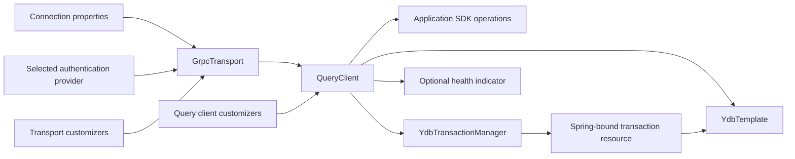

# YDB Spring Boot Starter: proposed design

Status: design draft, 2026-09-17. No implementation or compatibility claim is implied.

## Purpose and requirements

Provide a community integration of the native YDB Java SDK with Spring Boot. An application adds one dependency, configures a connection, and injects SDK clients managed by Spring.

The public API, configuration model, lifecycle, and tests are designed independently for this project. They contain no application-specific types, persistence selection policy, compatibility aliases, or dependencies on another application's source or build.

Requirements:

- One repository: `madduck-tech/ydb-spring-boot-starter`.
- Target JVMs: Java 17, 21, and 25; compile library bytecode with `--release 17`.
- Target framework: Spring Boot 4. Minor versions have an explicit tested support matrix.
- License: Apache-2.0, as present in the repository.
- User beans override automatic creation; the starter owns only resources it creates.
- Optional integrations must not be required for basic connectivity.
- Public documentation and examples describe this library independently.

## First-release scope

Release 0.1 includes three application-facing capabilities: native SDK access, a synchronous `YdbTemplate`, and Spring `@Transactional` support through `YdbTransactionManager`. It also provides connection properties, authentication selection, SDK lifecycle management, builder customization, and optional health integration.

These three capabilities are required scope. Their proposed contracts, failure semantics, and implementation gates are specified in [Template and transaction design](transactions.md).

`YdbTemplate` participates in transactions managed by `YdbTransactionManager` and translates SDK operation failures into Spring exceptions. Direct calls on `QueryClient` retain native SDK semantics and do not automatically enlist. Repositories, schema migrations, routing, distributed transactions, and implicit business-method retries remain outside 0.1.

SDK futures and streaming remain available. The starter does not make them Reactor APIs or implicitly block them. Table, scheme, topic, and coordination clients may be constructed by applications from the transport; no beans for those clients are created automatically in 0.1. The SDK query module itself has a transitive dependency on the table module.

## Repository and artifacts

```text
ydb-spring-boot-starter/
  ydb-spring/               template and transaction integration with Spring Framework
  ydb-spring-boot/          integration code and optional health configuration
  ydb-spring-boot-starter/  dependency-only starter
  samples/minimal/         standalone consumer example
  samples/custom-client/   user-owned SDK resource example
  samples/transactions/    declarative and programmatic transactions
  docs/                    maintained product documentation
  .github/workflows/       build, integration tests, release
```

Use one Gradle multi-project build, one release version, and three published library artifacts. The template and transaction manager belong in `ydb-spring`, which has no Spring Boot dependency and can be tested as Spring Framework components. No additional repository is needed. Examples are not published libraries.

Proposed Maven group: `io.github.madduck-tech`. Namespace ownership must be verified before publication. Proposed Java package: `io.github.madducktech.ydb`; the Java package omits the organization name's hyphen. These are proposals, not existing published coordinates.

| Artifact | Responsibility | Dependency policy |
| --- | --- | --- |
| `ydb-spring` | Template, result mapping, exception translation, transaction manager | Native SDK and Spring Framework context/transaction APIs; no Boot dependency |
| `ydb-spring-boot` | Properties, bean configuration, builder customization interfaces, optional health | `ydb-spring`, Boot autoconfiguration and transaction integration; health dependencies optional for consumers |
| `ydb-spring-boot-starter` | Ready-to-use dependency set | Integration artifact, `spring-boot-starter`, `spring-boot-transaction`, YDB query SDK |

The integration artifact may depend normally on the native SDK: its purpose and customization API require it. Health and cloud authentication remain optional. The starter does not pull in Actuator, a web server, cloud credentials libraries, Arrow, JDBC, or Spring Data.

Gradle `compileOnly`/optional publication metadata must be checked in both generated POM and Gradle module metadata. Test a consumer without health libraries; do not infer optionality from the producer's compile classpath.

## Bean construction and replacement



`ydb.enabled` defaults to `true` when the starter is present. Explicit `false` disables all starter configurations, including health. It does not remove or close application-defined beans.

| Existing user beans | Starter creates | Required configuration |
| --- | --- | --- |
| None | Authentication provider, transport, query client | Connection string and an explicit authentication choice |
| Authentication provider | Transport and query client | Connection string; authentication properties do not select another provider |
| Transport, no query client | Query client only | No connection string or authentication properties required |
| Query client | No authentication provider, transport, or additional query client | Template/transaction settings and health settings where active |
| Transport and query client | No SDK resources | Template/transaction settings and health settings where active |
| Integration disabled | Nothing | No YDB configuration required |

An existing query client suppresses the whole default resource construction path, not just the client factory method. This avoids opening an unused transport. A supplied transport likewise suppresses default authentication creation.

The table describes SDK resources. A user query client can still receive an auto-configured template and transaction manager. Each higher-level component backs off independently; manager coexistence and selection are defined in the transaction design.

Use type-based back-off. When a downstream component needs a bean, accept one candidate or one `@Primary` candidate. If resolution remains ambiguous, fail with an actionable message; never select a bean by registration order. Multiple query clients are application-managed; automatic health requires an unambiguous candidate or a user-provided YDB health contributor.

Register dedicated configurations through `AutoConfiguration.imports`; do not use component scanning. Proposed configurations:

- `YdbAutoConfiguration`: activation and SDK resource graph.
- `YdbTemplateAutoConfiguration`: template defaults and back-off for a user implementation of `YdbOperations`.
- `YdbTransactionAutoConfiguration`: manager selection and Boot transaction infrastructure; see the explicit ordering and coexistence contract in the transaction design.
- `YdbHealthAutoConfiguration`: ordered after the resource configuration and guarded by health class availability, health toggle, and a query client candidate.

Properties use Spring Boot binding and metadata. Validate the settings needed by the active creation path before that path creates any network resources. Do not put unconditional connection-string validation on a properties object used by applications that supply a client. Normal type-conversion errors on supplied properties may still fail binding; unused semantic requirements must not.

## Public extension points

The proposed public surface consists of `YdbOperations`, `YdbTemplate`, result/option/mapping types, `YdbTransactionManager`, typed exceptions, properties, documented configuration exclusions, and two builder customization interfaces:

```java
@FunctionalInterface
public interface YdbTransportBuilderCustomizer {
    void customize(GrpcTransportBuilder builder);
}

@FunctionalInterface
public interface YdbQueryClientBuilderCustomizer {
    void customize(QueryClient.Builder builder);
}
```

Factories apply library defaults, bound properties, selected authentication, and then ordered customizers. Customizers run in Spring order and can override builder settings. They must not call `build()` or create unmanaged resources. They are not invoked for user-supplied transport/client beans. Applications needing complete control supply the corresponding bean.

For a direct authentication bean, support the current `tech.ydb.auth.AuthProvider` API. Do not introduce a proprietary credentials interface. Transport-aware SDK providers can be installed by a transport customizer using the SDK builder's typed API. Before expanding automatic discovery to `AuthRpcProvider`, prove generic matching and compatibility without exposing an SDK `impl` package in this library's public signatures.

## Configuration contract

Minimal local example:

```yaml
ydb:
  connection-string: grpc://localhost:2136/local
  auth:
    mode: anonymous
```

The proposed names and defaults below are this library's design choices. They are not copied automatically from a moving SDK release.

| Property | Default | Meaning and constraints |
| --- | --- | --- |
| `ydb.enabled` | `true` | Enable the integration |
| `ydb.connection-string` | None | Required only for a starter-created transport; explicit `grpc` or `grpcs`, endpoint, and database path |
| `ydb.transport.init-mode` | `sync` | `sync` waits for initial discovery; `async` starts discovery without waiting |
| `ydb.transport.discovery-timeout` | `10s` | SDK discovery timeout, positive and at least 1 ms; not a universal startup deadline |
| `ydb.transport.tls.ca-certificate` | None | Optional PEM trust certificate resource for a `grpcs` connection; `classpath:` or `file:` |
| `ydb.auth.mode` | None | Required when the starter selects authentication: `anonymous`, `token`, or `environment` |
| `ydb.auth.token` | None | Required and nonblank in token mode; resolved by normal external configuration |
| `ydb.session-pool.min-size` | `0` | Nonnegative and no greater than max-size |
| `ydb.session-pool.max-size` | `50` | Positive maximum session count |
| `ydb.session-pool.max-idle-time` | `5m` | Between 1 second and 30 minutes for the inspected SDK |
| `ydb.template.query-timeout` | `10s` | Total template-call budget, further bounded by the active transaction deadline |
| `ydb.template.max-result-rows` | `10000` | Aggregate row limit for a materialized query result |
| `ydb.template.max-result-bytes` | `16MB` | Aggregate serialized result-part limit; not a JVM heap limit |
| `ydb.transactions.mode` | `auto` | `auto`, `enabled`, or `disabled`; controls default manager creation, not user beans |
| `ydb.transactions.default-timeout` | `30s` | Default new physical transaction budget, including acquisition and commit |
| `ydb.transactions.cleanup-timeout` | `5s` | Separate bounded rollback/cleanup RPC budget after failure |
| `ydb.health.timeout` | `2s` | Positive total probe budget for session acquisition and query execution |
| `management.health.ydb.enabled` | Boot health convention | Enable/disable the YDB contributor; honor global health defaults |

Validate pool settings before opening a starter-created transport. Apply pool max before min so a valid pair such as min=60/max=100 is not rejected against an intermediate SDK default.

Use the SDK's canonical path connection-string form. Validate the scheme, endpoint, database, and absence of embedded credentials before parsing. The initial implementation rejects the SDK's legacy `?database=` syntax. Diagnostic errors identify the property without echoing credentials or the original untrusted connection string.

TLS follows the `grpcs` scheme. Reject a custom CA with a plaintext connection. Do not offer a trust-all switch. Customizers remain available for advanced channel configuration.

Template and transaction timeouts govern only operations managed by those components. They do not govern arbitrary direct SDK calls. There is no `connect-timeout` property: the inspected SDK's corresponding methods are deprecated no-ops. No global `retry-count` or transparent query replay is configured. See the transaction design for deadline precedence and commit uncertainty.

## Authentication

Select credentials only when creating a transport. A user authentication bean takes precedence; otherwise require an explicit mode. No implicit cloud metadata lookup occurs in the default path.

- `anonymous`: use the SDK's no-auth provider, suitable for a local server configured without authentication.
- `token`: construct the SDK token provider from externally supplied configuration. The starter does not implement token refresh; use a provider when refresh is needed.
- `environment`: delegate to the inspected SDK environment provider. Its environment-variable precedence and metadata fallback must be documented for the pinned SDK version. This reads the process environment, not arbitrary Spring properties with similar names.

Environment mode may require `tech.ydb.auth:yc-auth-provider` or `tech.ydb.auth:ydb-oauth2-provider`, depending on the selected SDK credentials path. Missing required classes must produce a clear dependency diagnostic. Never fall back to anonymous after an authentication error. Cloud provider versions and representative provider compatibility are release gates; cloud libraries are not added to the default starter.

The application may supply an authentication bean with any SDK implementation satisfying the supported API, or customize the transport for provider APIs outside that interface. Document both approaches with compiled examples. Do not log token values, key material, or raw authentication exceptions containing them.

## Lifecycle and failure handling

Each starter-created closeable SDK resource is a separate singleton bean with an explicit destroy method. Dependencies ensure the query client closes before its transport. There is no aggregate executor that closes borrowed resources.

| Resource | Lifetime owner |
| --- | --- |
| Starter-created query client | Spring bean lifecycle configured by the starter |
| Starter-created transport | Spring bean lifecycle configured by the starter |
| User-provided resource | Its defining configuration; the starter adds no destroy callback |
| SDK auth identity created for a transport | SDK transport, according to its provider contract |
| Query session/stream acquired by application code | Application code or the SDK helper used by that code |
| Session/stream acquired by the health check | Health implementation |
| Session/stream acquired by a standalone template call | Template operation scope |
| Session/transaction used within a Spring YDB transaction | Transaction manager until completion; template borrows it |

Spring may infer `close()` on an application-defined `@Bean`. For an externally owned shared resource, its owner must explicitly disable that bean's inferred destruction with `destroyMethod = ""`. “The starter does not close it” does not disable Spring's normal lifecycle.

If client creation fails after transport registration, context failure cleanup must close the transport. Failure to close a client must not prevent Spring from attempting transport destruction. If construction fails before an object becomes a managed bean, cleanup belongs to that construction path or the SDK builder. Verify these paths using injected failures before claiming leak-free startup.

Synchronous discovery reports connection/authentication failure during startup. Async discovery permits application startup without a successful connection and does not imply readiness. The discovery timeout is not promised to bound credential acquisition and every SDK cleanup phase.

Applications drain their work before context shutdown. Version 0.1 does not promise completion of arbitrary in-flight application queries when the context closes.

## Queries, transactions, and retries

Applications can inject `QueryClient` for native access or `YdbOperations` for synchronous queries. The template reuses the session and transaction bound by `YdbTransactionManager` to the selected query client. Outside a Spring YDB transaction, a template call owns a short transaction and its session.

Use Spring `@Transactional` or `TransactionTemplate` for multi-call atomicity. Transactions are thread-bound; direct SDK calls and asynchronous tasks are not automatically enlisted. Never retry an individual statement inside a transaction. Neither the template nor the manager replays application code automatically.

The [transaction design](transactions.md) defines the proposed API, propagation, isolation, rollback-only handling, bounded result collection, exception categories, and unknown commit outcomes. Its acceptance tests are required for 0.1.

## Optional health integration

Use a synchronous Boot health indicator named `ydbHealthIndicator` with contributor ID `ydb`. Register it only when the optional health classes and a usable query client exist, the integration is enabled, and Boot's YDB health condition allows it. Back off when the application provides the named contributor. Isolate all references to optional classes.

The probe acquires a session, runs a fixed `SELECT 1` through Query Service, waits for the final success status, and releases the session. It does not create tables or retry. Success checks connectivity, credentials, and query-service availability; it does not prove permissions on application tables.

Use one monotonic deadline across acquisition and execution, passing the remaining budget into SDK calls. On timeout, return `DOWN`, cancel the query stream if started, and arrange eventual cleanup of a session that arrives after timeout. Cancelling a `CompletableFuture` alone is not proof of RPC cancellation. Bound the number of in-flight probes with a per-indicator single-flight mechanism so repeated timeouts cannot create unlimited pending acquisitions. These semantics require focused implementation tests.

Return sanitized status information, not database paths, tokens, SQL values, or raw server exception messages. Restore interruption when interrupted. Pool exhaustion also results in `DOWN`; using the application pool makes the probe reflect the application's ability to acquire a session.

The starter does not edit liveness/readiness group membership. Applications can explicitly include `ydb` in readiness. Automatic metrics binding and tracing adapters are deferred; builder customization allows the SDK's facilities to be configured without a new public observability API.

## Compatibility, dependencies, and publication

Initial matrix proposal:

| Library bytecode | Runtime JDKs | Boot versions to verify |
| --- | --- | --- |
| Java 17 | 17, 21, 25 | 4.0.8 and 4.1.1 |

Compile against the lower supported Boot minor line. Verify the same produced library artifacts across all six combinations, including a real query. Pin exact patch versions in the build; do not promise compatibility with every future Boot 4 minor automatically.

SDK `2.4.11` is the inspected release candidate for implementation, not a claim that it is the latest available release. Align SDK modules through its BOM and inspect the final gRPC/protobuf/auth dependency graph under each Boot BOM. Dependency bytecode and native transport behavior must work on Java 17. The repository build can run on a pinned JDK 21 with separate toolchains; consumer runtime compatibility does not require the build tool itself to run on every supported JDK.

Use `java-library` for library modules, publish plain JARs, sources, and Javadoc. Samples can use the Boot application plugin. Verify Maven and Gradle consumers from a temporary published repository rather than only project dependencies. Check that optional health/cloud dependencies do not leak into the base consumer.

Do not claim Boot 3, Android, native-image, or AOT support in 0.1. Those require their own compatibility work. Artifact versioning begins with a preview such as `0.1.0`; document breaking changes between preview releases.

## Acceptance criteria

| Area | Required evidence |
| --- | --- |
| Activation | Enabled and disabled context cases; missing/invalid required properties fail before resource creation |
| Replacement | Every row of the bean matrix, primary selection, ambiguous candidates, customizer order, unused settings |
| Classpath | No health/cloud classes present; missing selected auth library has an actionable error |
| Lifecycle | Normal close order, borrowed resources, failed client construction, throwing destroy methods, partial startup |
| Properties | Binding, duration bounds, TLS selection, auth precedence, metadata, redacted diagnostics |
| Discovery | Sync success/failure and async startup with an unavailable server |
| SDK usage | Real parameterized query and commit/rollback examples against an isolated local YDB database |
| Template | Parameter binding, multi-result handling, row mapping, bounded materialization, cancellation, standalone commit/rollback |
| Spring transactions | Proxy-based `@Transactional`, `TransactionTemplate`, propagation, isolation, rollback-only, suspend/resume, synchronization, unknown commit outcomes |
| Health | Successful query, denied auth, unavailable server, pool exhaustion, timeout, late session, cancellation, single-flight, cleanup |
| Coexistence | Other database autoconfigurations remain enabled; no property-source mutation |
| Packaging | Automatic imports discovered from published JAR; standalone Maven and Gradle consumers |
| Compatibility | Same built artifacts exercised on Java 17/21/25 and the selected Boot 4 versions |

Use `ApplicationContextRunner` for configuration contracts and a separate application test for discovery from the published JAR. Use a pinned YDB container image and isolated database/table names for integration tests. Test doubles or controlled faults are appropriate for cleanup and timeout races that cannot be induced reliably on a real server.

## Implementation sequence

1. Validate the proposed template/transaction contracts and publication namespace. Record exact dependency versions and supported auth provider signatures.
2. Establish the three-module build and publication metadata; test a standalone consumer on Java 17.
3. Implement properties, conditional resource creation, authentication selection, ordered customizers, and lifecycle tests.
4. Implement the shared operation/resource handling, template, and transaction manager with failure-injection and real YDB tests. Verify declarative proxy behavior from a published starter.
5. Add examples and optional health with cancellation/cleanup tests.
6. Run the full compatibility and consumer matrix; prepare configuration reference, README, and release instructions from verified behavior.

The first implementation change should establish resource creation/replacement and lifecycle. Release 0.1 is complete only when the template and Spring transaction contracts also pass their acceptance tests.

## Evidence and remaining validation

The design was checked against official Spring documentation and the YDB SDK release `v2.4.11`, source commit `ce48d1710fb3b0564e7eeb59b1926269d567f080`. Source inspection supports API mapping; it does not replace runtime tests.

- [Spring Boot custom autoconfiguration and starter conventions](https://docs.spring.io/spring-boot/reference/features/developing-auto-configuration.html): registration, conditional configuration, and module naming.
- [Spring Boot system requirements](https://docs.spring.io/spring-boot/system-requirements.html): Java baseline and framework/build-tool constraints.
- [Spring Boot health endpoints](https://docs.spring.io/spring-boot/reference/actuator/endpoints.html): contributor configuration and health groups.
- [SDK QueryClient API](https://github.com/ydb-platform/ydb-java-sdk/blob/v2.4.11/query/src/main/java/tech/ydb/query/QueryClient.java) and [implementation](https://github.com/ydb-platform/ydb-java-sdk/blob/v2.4.11/query/src/main/java/tech/ydb/query/impl/QueryClientImpl.java): client does not own the supplied transport; pool settings and bounds.
- [SDK transport builder](https://github.com/ydb-platform/ydb-java-sdk/blob/v2.4.11/core/src/main/java/tech/ydb/core/grpc/GrpcTransportBuilder.java): discovery modes, discovery timeout, and deprecated no-op connect timeout.
- [SDK connection-string parser](https://github.com/ydb-platform/ydb-java-sdk/blob/v2.4.11/core/src/main/java/tech/ydb/core/grpc/GrpcTransport.java): path syntax and legacy query-parameter syntax.
- [SDK environment authentication provider](https://github.com/ydb-platform/ydb-java-sdk/blob/v2.4.11/core/src/main/java/tech/ydb/core/auth/EnvironAuthProvider.java): explicit environment selection and optional provider dependencies.
- [SDK auth options lifecycle](https://github.com/ydb-platform/ydb-java-sdk/blob/v2.4.11/core/src/main/java/tech/ydb/core/impl/auth/AuthCallOptions.java): transport-created identity cleanup.
- [SDK retry context](https://github.com/ydb-platform/ydb-java-sdk/blob/v2.4.11/query/src/main/java/tech/ydb/query/tools/SessionRetryContext.java): operation-specific retries and idempotency.

The SDK, template, and Spring transaction scope is selected. The detailed contracts remain design proposals. During implementation, prove auth provider compatibility, optional health isolation on both Boot minors, transaction outcome handling, resource cleanup on failure, and probe cancellation races. Before publication, verify namespace ownership and the complete compatibility matrix. These are explicit gates, not completed checks.
