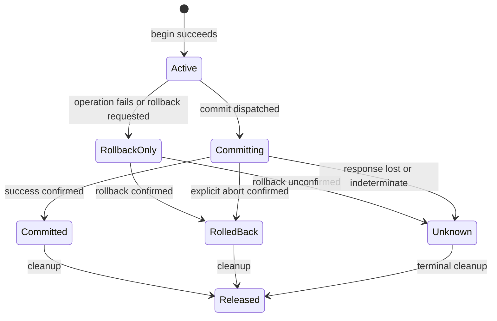

# YdbTemplate and Spring transaction design

Status: proposed contracts, 2026-09-17. Native SDK access, `YdbTemplate`, and `@Transactional` support are required for the first release. No implementation or passing tests are claimed here. See [the overall design](design.md) for connection and lifecycle configuration.

## Components and ownership

Place the template, transaction manager, operation settings, result types, and exception translation in `ydb-spring`. This module depends on Spring Framework and the native SDK, with no Boot dependency. Boot property binding and bean conditions belong in `ydb-spring-boot`; the dependency-only starter exposes the complete integration.

Proposed packages under `io.github.madducktech.ydb`:

| Package | Public types |
| --- | --- |
| `core` | `YdbOperations`, `YdbTemplate`, `YdbQueryOptions`, `YdbResult`, `YdbRowMapper` |
| `transaction` | `YdbTransactionManager`, `YdbCommitOutcomeUnknownException` |
| `exception` | Documented YDB-specific Spring exception subtypes where standard types cannot express the outcome |

Resource holders, state transitions, session acquisition, stream cancellation, and SDK-to-Spring exception mapping are internal. There is no public application-specific executor or proprietary transaction annotation.

## Proposed template API

Illustrative signatures, to be compiled and validated during implementation:

```java
public interface YdbOperations {
    QueryInfo execute(String yql, Params params);
    QueryInfo execute(String yql, Params params, YdbQueryOptions options);

    YdbResult query(String yql, Params params);
    YdbResult query(String yql, Params params, YdbQueryOptions options);

    <T> List<T> query(String yql, Params params, YdbRowMapper<T> mapper);
    <T> List<T> query(String yql, Params params,
                      YdbQueryOptions options, YdbRowMapper<T> mapper);
}

@FunctionalInterface
public interface YdbRowMapper<T> {
    T mapRow(ResultSetReader row, int rowNum);
}
```

`Params`, `QueryInfo`, and `ResultSetReader` are native SDK types. Parameterless calls can use `Params.empty()`; no second parameter/type system or reflection-based entity mapping is introduced. No raw query concatenation helpers are needed.

`YdbTemplate` is safe to share between threads after construction. It holds an immutable default configuration and a query client, never a mutable current session. `YdbQueryOptions` is immutable and provides per-call timeout and result limits; omitted values inherit template defaults. Neither type exposes commit-at-end or a transaction mode override that could replace an active Spring transaction.

`execute` waits for final query success and drains/discards result rows; it returns SDK query metadata, not a fabricated affected-row count. `query` collects all result sets and exposes a detached `YdbResult` with result-set count, indexed readers, and metadata. Each reader has its own cursor; readers and a caller's mutable `Params` are not made thread-safe by the template.

The mapper overload requires exactly one result set and applies the mapper on the calling thread after bounded collection. The row cursor is already positioned; the mapper must not advance or retain it. It must return a detached application value. Zero rows yields an empty list. Multiple result sets produce an API usage error; use the `YdbResult` overload instead. Null mapper results may be retained as list elements and must be documented rather than silently dropped.

For collection, enforce aggregate limits across all result sets before adding the next part: proposed defaults are 10,000 rows and 16 MiB of serialized result parts. A part may already have been received before the limit check; these limits do not bound every SDK/gRPC allocation or mapped object's heap size. Cancel on overflow and fail without returning partial results. Detect server-truncated result sets as an error rather than presenting them as complete.

Do not use an unbounded SDK result collector and check limits afterwards. No stream escapes the template's operation scope. Large streaming workloads use the native SDK in 0.1. Query callbacks do not execute application code on SDK network threads.

### Per-call execution

1. Resolve a bound YDB holder for the same `QueryClient` identity; reject failed, completed, or currently executing holders.
2. If no holder exists, acquire a session and explicitly begin a short `SERIALIZABLE_RW` transaction owned by this call.
3. Execute through `QueryTransaction.createQuery(..., commitAtEnd=false, ...)` with a bounded request deadline.
4. Await final status; collect and map where applicable. For a call-owned transaction, commit only after successful mapping. For a borrowed transaction, leave commit to its manager.
5. On failure, mark a borrowed holder rollback-only and terminal for further query execution; roll back a call-owned transaction where its outcome allows that. Close only the session owned by the call.

A returned template result inside `@Transactional` confirms query execution, not the enclosing transaction's eventual commit. Mapping/cardinality errors make the template operation fail and cause a borrowed transaction to become rollback-only even when application code catches the error.

Use this path for DML, including reads. Do not select SDK implicit transaction mode, silently switch to autocommit, or fall back outside a transaction when YDB rejects a statement. DDL, schema management, YQL transaction-control commands, and nontransactional batch modification statements are outside the template contract; use native APIs separately. A client-side SQL parser is not part of 0.1, so acceptance tests must check representative forbidden statements against the pinned server and prevent hidden commits.

## Spring transaction manager

Implement `YdbTransactionManager` using Spring's `AbstractPlatformTransactionManager`. Accept a `QueryClient` in its constructor. The manager and all participating templates must use the same client instance. The manager never closes the client.

Use `TransactionSynchronizationManager` with that query client as the resource key. A private holder records the session, native transaction, absolute monotonic deadline, effective isolation/read-only flags, rollback-only state, operation-in-progress guard, and explicit completion state. Do not infer transaction state solely from an SDK transaction ID.

The SDK can clear a transaction ID after failure and start a new transaction if another query is issued on the same object. The holder must prevent this from silently splitting one Spring transaction into multiple database transactions. A successful SDK `commit()` on an inactive object is also not proof that the intended database transaction committed.

Create the session and explicitly begin the native transaction in `doBegin`. Bind only after successful initialization. If acquisition or begin completes after its deadline, perform eventual rollback/session cleanup without exposing it to application code. Partial initialization cleanup remains the manager's responsibility because this holder is not a singleton bean.

Implement begin, existing-transaction detection, commit, rollback, mark-rollback-only, suspend, resume, and cleanup hooks. Use Spring's normal synchronization callbacks and rollback rules. Test the default rollback-on-runtime-exception/error behavior, checked exceptions, `rollbackFor`, and `noRollbackFor`; an invalidated database transaction cannot be made committable by `noRollbackFor`.

Set validation of participating transaction definitions on. Preserve global rollback on participation failure. Keep rollback-on-commit-failure off so a lost commit response is not converted into a false rollback claim. Nested savepoints remain unavailable.

### Propagation

| Spring propagation | Proposed behavior |
| --- | --- |
| `REQUIRED` | Join the existing YDB holder or create a new transaction |
| `REQUIRES_NEW` | Suspend outer YDB holder and synchronization; acquire a separate session; complete inner transaction and restore outer state |
| `SUPPORTS` | Join if present; otherwise each template call owns its short transaction |
| `MANDATORY` | Require a current YDB transaction or fail before any request |
| `NOT_SUPPORTED` | Suspend the current YDB transaction; template calls complete independently; then resume |
| `NEVER` | Fail when a YDB transaction is present; otherwise independent template calls |
| `NESTED` | With an existing transaction, throw `NestedTransactionNotSupportedException`; without one, Spring can create a normal transaction |

Never substitute a joined transaction for a requested savepoint. A caught failure from an inner `REQUIRED` scope leaves the shared holder rollback-only, and attempted outer commit reports `UnexpectedRollbackException` where Spring's participating rollback rules apply.

An outer session remains occupied during `REQUIRES_NEW`. Pool sizing must account for suspended sessions and nesting depth. Acquisition has a finite deadline; pool exhaustion cannot block indefinitely. If beginning the inner transaction fails, resume the outer holder and synchronization.

### Isolation and read-only

| Spring isolation | Initial mapping |
| --- | --- |
| `DEFAULT` | `SERIALIZABLE_RW` |
| `SERIALIZABLE` | `SERIALIZABLE_RW` |
| `READ_UNCOMMITTED`, `READ_COMMITTED`, `REPEATABLE_READ` | Reject with `InvalidIsolationLevelException` before acquisition |

This is a deliberately narrow first-release mapping. SDK enum values for other modes are not sufficient evidence for corresponding Spring isolation guarantees on every supported server. Store the effective `SERIALIZABLE` level even when the annotation requests `DEFAULT`, so a participating explicit `SERIALIZABLE` scope does not produce a false mismatch.

Storing the level only in the holder is insufficient: Spring validates participation against `TransactionSynchronizationManager`. After the base `prepareSynchronization` initializes a new synchronization for an actual YDB transaction, set its current isolation level to the holder's effective level. Do not set a synthetic isolation level for empty `SUPPORTS` scopes. Suspension/resumption must preserve the effective value. This requires a regression test with outer `DEFAULT`, inner `SERIALIZABLE`, followed by a different transaction on the same thread.

In 0.1, `readOnly=true` is a Spring hint; it does not change the database isolation mode or guarantee that writes are rejected. Keep it in the holder and validate incompatible participating definitions. In particular, an inner read-write definition must not join a read-only outer definition. Do not automatically downgrade to snapshot/stale/online reads. Read-only enforcement or an explicit YDB-specific isolation selection requires a separate, tested API decision.

### Deadlines and threads

The physical transaction deadline starts before session acquisition. An explicit Spring transaction timeout overrides the configured default. A participating scope inherits the outer deadline; it does not restart or extend it. Normalize `DEFAULT` isolation separately from the timeout's default marker. Accept zero Spring timeout as immediately expired, and reject invalid negative timeout values other than the standard default marker.

Each template call is bounded by the smaller of its call budget and the remaining transaction budget. Begin/query/commit requests receive the remaining budget through SDK request settings. Deadline exhaustion before sending commit causes rollback; expiry after commit dispatch may mean an unknown outcome. Reject sub-millisecond configured durations that would accidentally round to an unbounded SDK timeout. Manager default durations must be representable by Spring's timeout contract; require positive whole seconds for the manager's configured default.

Recheck the holder and deadline immediately before commit dispatch, including after Spring's before-commit callbacks. If this check requires rollback, perform that rollback and report confirmed rollback with `UnexpectedRollbackException` retaining the timeout/failure cause; an unconfirmed rollback remains a system failure with unknown completion. Do not merely throw `TransactionTimedOutException` from `doCommit` and assume the base manager will roll back: rollback-on-commit-failure is intentionally disabled.

Rollback after failure gets a separate bounded cleanup budget (proposed 5 seconds) even when the operation deadline has expired. Unbind resources in all completion paths. Closing a borrowed session while a query is still executing is forbidden; cancellation and eventual terminal cleanup must account for late completions. A query timeout does not imply that arbitrary user code is interrupted or that SDK `close()` itself has a hard execution bound.

Transactions are imperative and bound to the invoking thread. `@Async`, new threads, reactive pipelines, and work scheduled after a method returns do not inherit the holder. Java virtual threads are supported only under the same thread-bound execution contract. No `ReactiveTransactionManager` is supplied.

The manager forbids overlapping operations on the same holder. Pure result mapping runs on the caller thread, but reentrant use of the same template transaction from a mapper is rejected rather than creating overlapping scopes. Native direct calls retain native ownership and are not automatically intercepted or enlisted.

## Commit outcomes, failures, and retries

Track these conceptual states explicitly:



`Unknown` includes different phases; retain the phase so an unconfirmed rollback is never described as an uncertain commit. Resource release is not an outcome classifier.

The implementation must store database outcome separately from resource lifecycle. Releasing a session cannot overwrite `COMMITTED`, `ROLLED_BACK`, or `UNKNOWN`. Track commit dispatch conservatively from entry into the SDK commit call; do not claim that a transport exception proves no request reached the server.

| Failure | Contract |
| --- | --- |
| Operation reports `ABORTED` before commit | Translate to `ConcurrencyFailureException`; invalidate the holder; never retry only that statement |
| Explicit commit rejection proving abort | Report rollback failure to the caller via `UnexpectedRollbackException` with the SDK cause/status retained; completion status is rolled back |
| Timeout/transport loss after commit dispatch, or `UNDETERMINED` | Throw `YdbCommitOutcomeUnknownException`, a `TransactionSystemException` subtype; synchronization completion is unknown |
| Commit success followed by session cleanup failure | Preserve committed outcome; report sanitized cleanup diagnostics without returning a retryable transaction failure |
| Rollback RPC fails | Report `TransactionSystemException`, preserve the original application failure where applicable, and mark completion unknown |
| Late commit response after caller timeout | Keep the already reported uncertainty; perform terminal cleanup, never start a second commit or transaction |

The unknown-commit type is not a transient/retryable data-access exception. Do not classify ambiguity by matching exception messages. Classify using operation phase and tested SDK status semantics; the unclassified commit-failure default is uncertainty. A local failure known to occur before commit dispatch remains eligible for rollback cleanup.

For template query operations, use Spring's `DataAccessException` hierarchy. Timeout becomes `QueryTimeoutException`; an explicit abort becomes `ConcurrencyFailureException`; resource-unavailable status before a commit attempt may become `DataAccessResourceFailureException`. Use a documented uncategorized YDB subtype for unmapped statuses, retaining structured status and cause. Do not map every `PRECONDITION_FAILED` to a duplicate-key exception or every `BAD_REQUEST` to invalid SQL. Mapper exceptions retain their cause and mark the operation failed.

Exceptions produced by the transaction manager use Spring's transaction exception hierarchy, including `CannotCreateTransactionException`, `TransactionTimedOutException`, and the completion outcomes above. Commit errors must not pass through the ordinary statement translator first.

Neither `YdbTemplate` nor `YdbTransactionManager` automatically retries a query, commit, or application method. A retry must encompass a fresh transaction and the entire business operation. Applications may put an explicitly configured retry outside the transaction boundary for confirmed aborts, provided their non-database effects can be repeated. Unknown outcomes and post-commit callbacks must not be classified as aborts. Do not place SDK `SessionRetryContext` around a borrowed transaction or use a global idempotency flag.

Spring `afterCommit` callbacks may themselves throw after a successful commit. Preserve Spring's callback semantics and document that such an exception is not evidence of rollback. Never automatically replay work because cleanup or a completion callback failed.

## Autoconfiguration and coexistence

Create a default `YdbTemplate` only when there is an unambiguous query client and no user `YdbOperations` bean. A user client does not suppress template/manager configuration. A user template does not suppress a missing transaction manager. A user manager is not replaced or reconfigured implicitly.

Default manager bean name: `ydbTransactionManager`. Do not add a `transactionManager` alias or mark it `@Primary` automatically.

| `ydb.transactions.mode` | Default manager creation |
| --- | --- |
| `auto` | Only when no Spring `TransactionManager` exists, including reactive or foreign managers |
| `enabled` | Create a YDB manager alongside foreign managers, unless a user YDB manager already exists |
| `disabled` | Do not create a manager; user-defined managers still work |

The broad back-off in `auto` prevents a new dependency from changing transaction selection in an existing application. A reserved-name collision with an unrelated bean produces an actionable configuration error. In `enabled` mode with multiple managers, applications select `@Transactional(transactionManager = "ydbTransactionManager")` or configure their own default.

Include `spring-boot-transaction`; `spring-tx` alone does not provide Boot's transaction autoconfiguration. Register the YDB manager after known JDBC/JPA/Mongo/R2DBC manager-producing configurations and Boot's transaction-manager customization configuration, using optional name-based ordering, and before Boot's generic `TransactionAutoConfiguration`. A user-defined manager is outside this default factory path.

For the default manager, use the implementable precedence: library defaults, explicitly bound YDB settings, then Boot's `TransactionManagerCustomizers` exactly once. That aggregate includes Spring transaction properties, execution listeners, and ordered user customizers; it is not a separate properties-only stage. Thus an explicitly configured `spring.transaction.default-timeout` can override the YDB timeout. Do not silently filter the aggregate to manufacture a different order. Document the precedence and test it on both Boot minors.

After customization, validate the manager's invariants: nested savepoints disabled, existing-definition validation enabled, global rollback on participation failure enabled, rollback-on-commit-failure disabled, and a finite supported default timeout. Report incompatible global properties/customizers as startup configuration errors. Final inherited setters cannot enforce these constraints alone: a manually constructed manager must validate them before transaction use as well. Runtime mutation of a shared manager's configuration is unsupported.

Rely on Boot's standard proxy activation and honor an application's own transaction-management configuration. Do not enable a second unconditional proxy infrastructure. A standalone Spring Framework application uses `@EnableTransactionManagement` itself.

The template detects an active foreign Spring transaction without a matching YDB holder and fails with `IllegalTransactionStateException`, instead of silently committing independent YDB writes. Applications can explicitly suspend the foreign transaction before independent YDB work. Creating a YDB transaction inside an already active foreign transaction is also rejected. Two local managers do not provide cross-database atomicity, and concurrent synchronization by unrelated managers on the same thread is outside the contract.

This guard cannot identify every programmer error: direct SDK calls or a template invocation on an unrelated new thread are outside Spring's enlistment path. Document that native access requires explicit native transaction handling. Resource identity, not merely matching connection strings, determines participation.

Minimal application shape:

```java
@Service
public class AccountService {
    private final YdbOperations ydb;

    public AccountService(YdbOperations ydb) {
        this.ydb = ydb;
    }

    @Transactional(transactionManager = "ydbTransactionManager")
    public void transfer(Params debit, Params credit) {
        ydb.execute(DEBIT_YQL, debit);
        ydb.execute(CREDIT_YQL, credit);
    }
}
```

The YQL constants are illustrative placeholders. The runnable sample must use declared, typed parameters and validate account/business invariants. The call must enter through a Spring proxy; self-invocation does not activate annotation-based transactions. Programmatic users can use Spring `TransactionTemplate` with the same manager.

## Required verification

Tests are required at three levels: focused lifecycle/state tests with controlled faults, real YDB integration tests, and a standalone Boot consumer of the published artifacts.

| Area | Release gate |
| --- | --- |
| Template | Parameters including optional/null types; all result sets; positioned row mapping; mapper exceptions; empty results; no synthetic row count |
| Result bounds | Limits checked during collection, multiple parts/sets, truncation, overflow cancellation, no partial success |
| Standalone call | Mapping precedes commit; failure rolls back; no leaked session after late acquisition or timeout |
| Atomicity | Two template calls commit together through a proxy; exception between them leaves neither committed |
| Participation | Same client shares holder; independent templates with that client join; different client cannot silently enlist |
| Rollback rules | Runtime/checked exceptions, `rollbackFor`/`noRollbackFor`, explicit rollback-only, caught inner failure, no SDK transaction restart |
| Propagation | Every propagation row; nested rejection; `REQUIRES_NEW` independence; outer restoration on failed inner begin; pool exhaustion |
| Isolation | Default/serializable normalization, unsupported level before acquisition, read-only hint and participating mismatch |
| Deadlines | Acquisition, begin, query, mapping boundary, commit before/after dispatch, suspended outer timeout, bounded rollback |
| Outcome | Confirmed abort, uncertain commit, late success, cleanup failure after success, original failure retained on rollback failure |
| Synchronization | Before/after callbacks, after-completion status including unknown, after-commit failure, no context leak on reused threads |
| Coexistence | Foreign imperative/reactive managers, qualified selection, user beans, customizer precedence, proxy activation, disabled integration |
| Native boundary | Direct SDK access remains independent; no implicit thread/async propagation |
| Packaging | Java 17/21/25 and supported Boot 4 matrix, Spring-only core consumer, no Boot dependency in `ydb-spring` |

No design claim of transaction correctness is complete until the failure cases pass. Pin a server image/version before defining supported transaction modes and rejecting representative nontransactional statements. Source review alone cannot establish server behavior.

## Sources

- [Spring transaction propagation](https://docs.spring.io/spring-framework/reference/data-access/transaction/declarative/tx-propagation.html).
- [Spring transaction manager extension API](https://docs.spring.io/spring-framework/docs/current/javadoc-api/org/springframework/transaction/support/AbstractPlatformTransactionManager.html).
- [Spring transaction workflow source](https://github.com/spring-projects/spring-framework/blob/v7.0.9/spring-tx/src/main/java/org/springframework/transaction/support/AbstractPlatformTransactionManager.java): completion handling must be verified against this workflow.
- [Spring declarative transaction configuration](https://docs.spring.io/spring-framework/reference/data-access/transaction/declarative/annotations.html).
- [Boot transaction module](https://docs.spring.io/spring-boot/appendix/auto-configuration-classes/spring-boot-transaction.html).
- [YDB transaction concepts](https://ydb.tech/docs/en/concepts/transactions).
- [SDK transaction API](https://github.com/ydb-platform/ydb-java-sdk/blob/v2.4.11/query/src/main/java/tech/ydb/query/QueryTransaction.java).
- [SDK transaction state implementation](https://github.com/ydb-platform/ydb-java-sdk/blob/v2.4.11/query/src/main/java/tech/ydb/query/impl/SessionImpl.java).
- [SDK status codes](https://github.com/ydb-platform/ydb-java-sdk/blob/v2.4.11/core/src/main/java/tech/ydb/core/StatusCode.java).
- [SDK result collection](https://github.com/ydb-platform/ydb-java-sdk/blob/v2.4.11/query/src/main/java/tech/ydb/query/tools/QueryReader.java): the convenience collector does not enforce this template's proposed size bounds.

The first-release capability scope is settled. Signature ergonomics, defaults, server baseline, and the proposed three-module split remain reviewable design decisions. Implementation must validate SDK behavior and Spring completion semantics before freezing public API.
